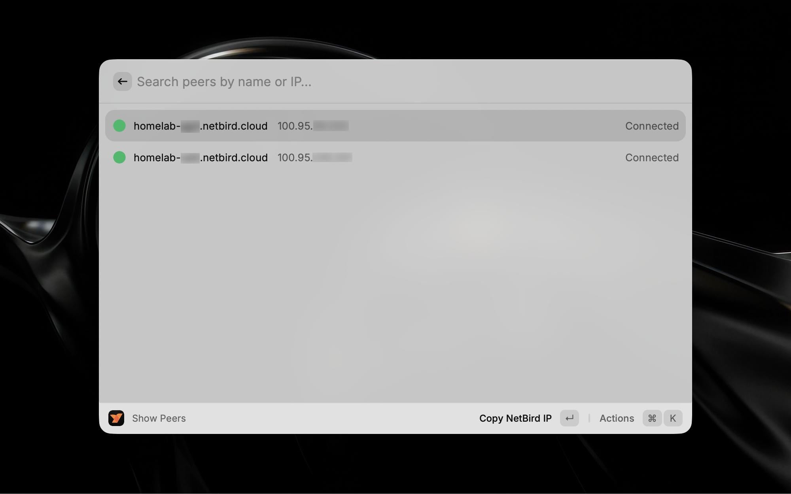
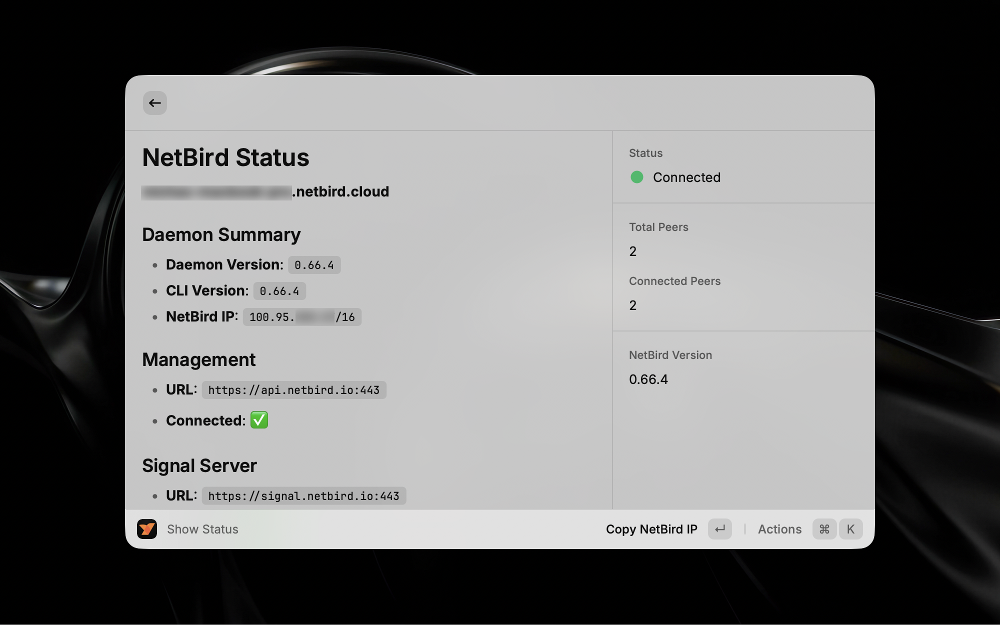

# NetBird Raycast Extension

An extension that allows you to manage your NetBird instance from Raycast. 

This extension uses the NetBird CLI to interact with your local NetBird app, so you need to have it installed and configured on your machine.

## Screenshots

